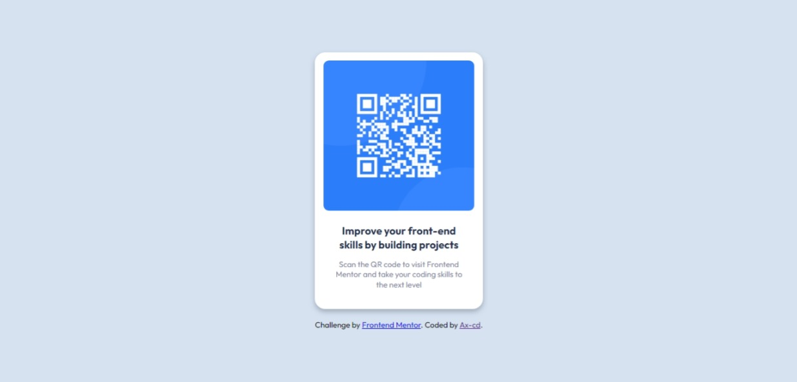

# Frontend Mentor - QR code component solution

This is a solution to the [QR code component challenge on Frontend Mentor](https://www.frontendmentor.io/challenges/qr-code-component-iux_sIO_H). Frontend Mentor challenges help you improve your coding skills by building realistic projects.

## Table of contents

- [Overview](#overview)
  - [Links](#links)
  - [Screenshot](#screenshot)
- [My process](#my-process)
  - [Built with](#built-with)
  - [Tested with](#tested-with)
  - [What I learned and continued development](#what-i-learned-and-continued-development)
  - [Useful resources](#useful-resources)
- [Author](#author)

## Overview

### Links

- Solution URL: [Frontend Mentor](https://www.frontendmentor.io/solutions/qr-code-card-with-html-and-sassscss-rkJ0fs6Nc)
- Live Site URL: [Netlify](https://qr-code-frontend-mentor-challenge.netlify.app/)

### Screenshot

## My process

### Built with

- Semantic HTML5 markup
- BEM
- Sass/Scss
- Flexbox

### Tested with

- W3C Markup Validator

### What I learned and continued development

- Sass/Scss: I took this challenge because it was a simple one as there weren't many elements to style, and so I could focus on setting up Scss files and overall working with Sass. I plan on using Sass in the future for more and more complex projects.
- Deployement: I learn to deploy with Netlify - until now I was solely using GitHub Pages.

### Useful resources

- ["Stop using @import with Sass | @use and @forward explained" by Kevin Powell](https://youtu.be/CR-a8upNjJ0) - A clear video on how to link the files using @use.
- ["Hébergement Gratuit (GitHub et Netlify) [FR]"](https://youtu.be/jXLV3LG4axE) - A quick and efficient tutorial (in French) on how to deploy a site using Netlify.

## Author

- GitHub - [Ax-cd](https://github.com/Ax-cd)
- Frontend Mentor - [@Ax-cd](https://www.frontendmentor.io/profile/Ax-cd)
- Instagram - [@ax.coding](https://www.instagram.com/ax.coding/)
